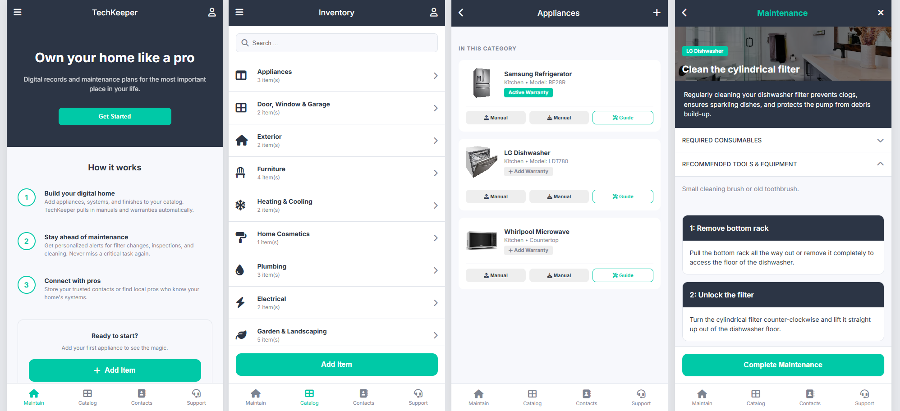

# TechKeeper - Home Management Platform
 

## 📖 About The Project
TechKeeper is a high-fidelity, responsive static web application designed as a comprehensive home management suite. It allows homeowners to digitize their assets, manage warranties, store documentation, and stay ahead of maintenance tasks through a sleek, mobile-first interface.

[](https://github.com/yourusername/TechKeeper)
[](https://github.com/yourusername/TechKeeper)
[](https://github.com/yourusername/TechKeeper)
[](LICENSE)

## 🚀 Key Features

- **Digital Home Catalog**: Organize your home into 10+ categories from Appliances to Security Systems.
- **Asset Lifecycle Management**: Complete CRUD flow (Add, View, Edit) for home items.
- **Warranty Tracking**: Dedicated management for protection plans with start/end date tracking and document linking.
- **Document Vault**: Centralized storage for user manuals, warranties, and insurance policies.
- **Guided Maintenance**: Step-by-step walkthroughs for appliance care (e.g., LG Dishwasher filter cleaning).
- **Service Pro Directory**: Manage trusted contacts and service history for your home.
- **User Personalization**: Fully customizable profiles, app settings (Dark Mode placeholder), and notification preferences.

## 📱 Mobile-First Design

Designed as a sleek mobile app running inside a desktop browser. On screens wider than 768px, the UI is automatically contained within a centered 480px container with a subtle box-shadow, maintaining the ergonomic feel of a modern mobile application.

## 🛠️ Technology Stack

- **HTML5**: Semantic structure for all 20+ pages.
- **CSS3**: Custom design system using CSS variables, Flexbox, and Sticky positioning.
- **Vanilla JavaScript**: Interactive logic for sidebar injection, navigation highlighting, and form simulations.
- **FontAwesome**: High-quality UI iconography.
- **Google Fonts**: Inter typography for a modern aesthetic.

## 📂 Project Structure

```text
├── index.html            # How It Works (Onboarding)
├── auth.html             # Login / Sign Up Flow
├── catalog.html          # Category Grid
├── inventory-list.html   # Category Drill-down
├── view-item.html        # Asset Details
├── warranty-details.html # Insurance & Policy View
├── contacts.html         # Service Pro Directory
├── documents.html        # Document Repository
├── style.css             # Unified Design System
└── script.js             # Interactive Engine
```

## 🏁 Getting Started

1. Clone the repository:
   ```bash
   git clone https://github.com/yourusername/TechKeeper.git
   ```
2. Open `index.html` in any modern web browser.
3. No build step or installation required—100% static assets.

---
*Created with focus on high-fidelity UI/UX and seamless user journeys.*
